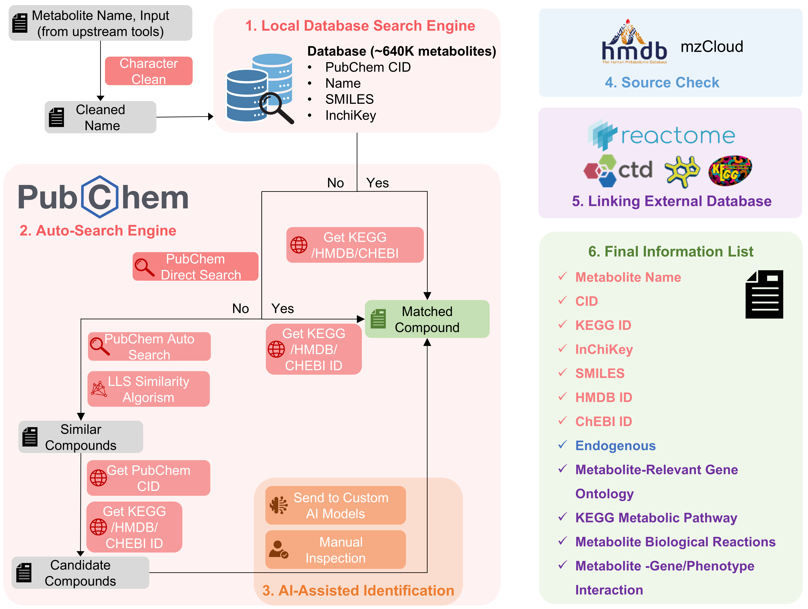
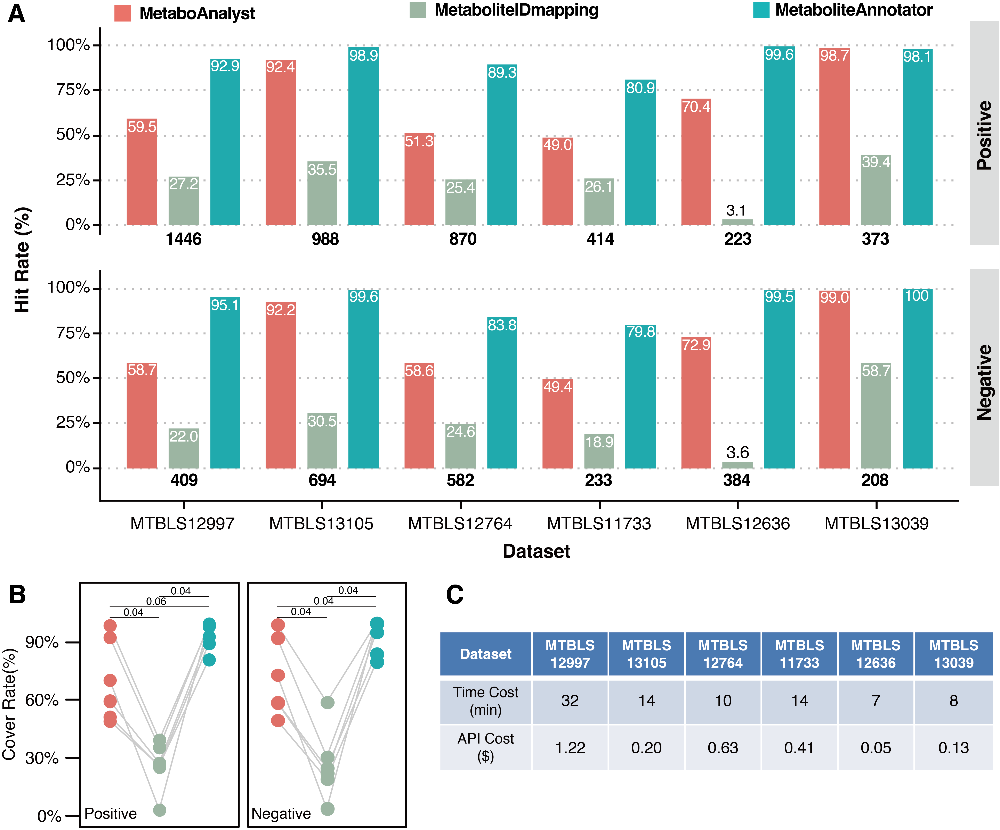

# MetaboliteAnnotator

> **DISCLAIMER:** This package is provided for academic and research purposes only. Commercial use is strictly prohibited without prior written consent from the authors.

> **Note:** The data linked with this package is integrated from the sources: `Pubchem`, `HMDB`, `mzCloud`, `KEGG`, `CTD`, `Reactome`, `ChEBI`. Detailed information please refer to the `Data sources` section.






## Features
- Real time database update
  - `Pubchem` real time API service
  - `HMDB` real time database update
  - `mzcloud` real time database update
  - `KEGG` real time API service
- Automated compound search and curation

- AI-assisted matching
  - support AI model: `GPT 4o-mini`, `deepseek-coder`...
  - Customized API key

- Endogenous metabolites checking
  - `HMDB` endogenous metabolites information
  - `mzcloud` endogenous metabolites information

- Real-time external dataset annotation
  - `KEGG` pathway enrichment analysis (81 metabolic pathways, 13 reaction pathways)
  - `Reactome` pathway enrichment analysis (10,000+ reactions)
  - `CTD` compound annotation (Chemical-Gene/Phenotype interaction, GO enrichment analysis)
  

## How to Run
- See https://github.com/zhonghua-ai/user_manual/blob/main/user_manual.md

## Data sources:

- `Pubchem`: https://pubchem.ncbi.nlm.nih.gov/
  - Kim S, Thiessen PA, Cheng T, Yu B, Bolton EE. An update on PUG-REST: RESTful interface for programmatic access to PubChem. Nucleic Acids Res. 2018 July 2; 46(W1):W563-570. doi:10.1093/nar/gky294.
  - Kim S, Thiessen PA, Bolton EE, Bryant SH. PUG-SOAP and PUG-REST: web services for programmatic access to chemical information in PubChem. Nucleic Acids Res. 2015 Jul 1; 43(W1):W605-W611. doi: 10.1093/nar/gkv396.
  - Kim S, Thiessen PA, Bolton EE. Programmatic Retrieval of Small Molecule Information from PubChem Using PUG-REST. In Kutchukian PS, ed. Chemical Biology Informatics and Modeling. Methods in Pharmacology and Toxicology. New York, NY: Humana Press, 2018, pp. 1-24. doi:10.1007/7653_2018_30.
- `HMDB`: https://hmdb.ca/
  - Wishart DS, Guo AC, Oler E, et al., HMDB 5.0: the Human Metabolome Database for 2022. Nucleic Acids Res. 2022. Jan 7;50(D1):D622–31. 34986597
- `mzCloud`: https://mzcloud.cn/
- `KEGG`: https://www.kegg.jp/
  - Kanehisa, M., Furumichi, M., Sato, Y., Matsuura, Y. and Ishiguro-Watanabe, M.; KEGG: biological systems database as a model of the real world. Nucleic Acids Res. 53, D672-D677 (2025).
- `CTD`: https://ctdbase.org/
  - Davis AP, Wiegers TC, Sciaky D, Barkalow F, Strong M, Wyatt B, Wiegers J, McMorran R, Abrar S, Mattingly CJ Comparative Toxicogenomics Database's 20th anniversary: update 2025. Nucleic Acids Res. 2024 Oct 10.
- `Reactome`: https://reactome.org/
  - Milacic M, Beavers D, Conley P, Gong C, Gillespie M, Griss J, Haw R, Jassal B, Matthews L, May B, Petryszak R, Ragueneau E, Rothfels K, Sevilla C, Shamovsky V, Stephan R, Tiwari K, Varusai T, Weiser J, Wright A, Wu G, Stein L, Hermjakob H, D'Eustachio P. The Reactome Pathway Knowledgebase 2024. Nucleic Acids Research. 2024. doi: 10.1093/nar/gkad1025.
- `ChEBI`: https://www.ebi.ac.uk/chebi/
  - Hastings J, Owen G, Dekker A, Ennis M, Kale N, Muthukrishnan V, Turner S, Swainston N, Mendes P, Steinbeck C. (2016). ChEBI in 2016: Improved services and an expanding collection of metabolites. Nucleic Acids Res.

## Issues
- If you have any issues, please report to the issue page.

## Citation
- If you use this application in your research, please cite the following paper:

```bibtex
test_bibtex
```
